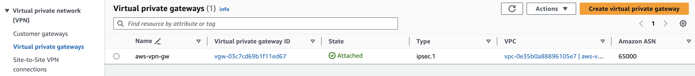

# Multi-Cloud HA VPN Automation with Terraform on AWS and GCP


This Terraform project facilitates the deployment of a Highly Available (HA) Virtual Private Network (VPN) infrastructure between Google Cloud Platform (GCP) and Amazon Web Services (AWS).

## Key Features


- **HA VPN Connection**: Ensures resilient connectivity between the VPCs.
- **Modular Structure**: Organized into modules for easier management and reusability.
- **Terraform Deployment**: Automates infrastructure provisioning and configuration.
- **Tested and Validated**: Verified functionality to ensure confidence in deployments.

# Prerequisites

Before you can use this project, you need to meet the following prerequisites:

## General

- **Terraform**: You need to have Terraform installed on your machine. You can [view the installation instructions here.](https://developer.hashicorp.com/terraform/install)

## Google Cloud Platform (GCP)

- **GCP Account**: You need to have a [GCP account](https://cloud.google.com) and a project with billing enabled.
- **Compute Engine API**: You need to enable the Compute Engine API for your project.
- **Permissions**: You need to be the GCP project owner or editor. This is for testing only. You can learn more about the importance of proper Identity and Access Management (IAM) usage [here.](./support-docs/ProductionConsiderations.md)
- **Google Cloud SDK**: Install the [gcloud CLI](https://cloud.google.com/sdk/docs/install) following the instructions here.
- **Authentication**: Authenticate your account in the CLI. You can learn more about Terraform and GCP accounts [here](https://registry.terraform.io/providers/hashicorp/google/latest/docs/guides/getting_started).

## Amazon Web Services (AWS)

- **AWS Account**: You need to have an [AWS account](https://aws.amazon.com/) with billing enabled.
- **IAM User**: You need to create an AWS user with the 'AdministratorAccess' IAM policy. This is for testing only. You can learn more about the importance of proper IAM usage here.
- **Access Key**: You need to [create an access key](https://docs.aws.amazon.com/IAM/latest/UserGuide/id_credentials_access-keys.html?icmpid=docs_iam_console#Using_CreateAccessKey) to authenticate your account with Terraform.
- **Key Pair**: You need to [create a key pair](https://docs.aws.amazon.com/servicecatalog/latest/adminguide/getstarted-keypair.html) for the AWS EC2 instance.
- **AWS CLI**: Install the [AWS CLI](https://docs.aws.amazon.com/cli/latest/userguide/getting-started-install.html) following the instructions here.
- **Authentication**: Learn more about Terraform and AWS access keys [here.](https://spacelift.io/blog/terraform-aws-provider)

# Installation

1. Clone this repository to your local machine using `git clone <repository-url>`.
2. Create a file named `secrets.tfvars` in the root of the repository. This file should contain values for all of the variables required by your Terraform configuration. You can refer to the [secrets-tfvars.txt](secrets-tfvars.txt) file for sample values. Be sure to replace the `gcp_project` value with your own.

## Google Setup

Before you can use the Google Cloud SDK, you need to authenticate your account and set your project and region:

1. Run `gcloud auth login` and follow the prompts to authenticate your account.
2. Run `gcloud config get project` to see which project you're currently in.
3. Run `gcloud auth list` to see which account you're using.
4. Run `gcloud config get-value compute/region` to see what region you're in.
5. Run `gcloud config set compute/region us-east1` to set the region to `us-east1` (*or your preferred region*).

## AWS Setup

Before you can use the AWS CLI, you need to authenticate your account and set your region:

1. Run `aws sts get-caller-identity --query Account --output text` to verify your account (*If it's your first time using the AWS CLI, you will have to run `aws configure`. [Learn more here](https://docs.aws.amazon.com/cli/latest/userguide/cli-authentication-user.html#cli-authentication-user-configure-wizard)*).
2. Run `aws configure get region` to view the current region.
3. Run `aws configure --region us-east-1` to set the region to `us-east-1` (*or your preferred region*).

## Terraform Setup

1. Run `terraform init` to initialize your Terraform configuration.
2. Run `terraform validate` to check for any misconfigurations.
3. Run `terraform plan -var-file=secrets.tfvars` to create an execution plan. This command will output a list of actions that Terraform will take based on your configuration files.

4. Review the plan and browse through the resources being created.
5. Run `terraform apply -var-file=secrets.tfvars` to apply your Terraform configuration. You will be prompted to confirm the changes. Enter `yes` to proceed or use `terraform apply -var-file=secrets.tfvars -auto-approve` to skip the confirmation prompt.

If you encounter the following error: `Error: Error creating Network: oauth2: "invalid_grant" "reauth related error"`, you will need to reauthenticate your Google account:

1. Run `gcloud auth application-default login` and follow the prompts to authenticate your account.
2. Run `terraform apply -var-file=secrets.tfvars -auto-approve` to continue applying your Terraform configuration.
<br><br>

# Checking the HA VPN Connection

Follow these steps to check the High Availability (HA) VPN connection:

1. Go to the AWS Console and view your instances. Note the private IP of the Test instance (e.g., `10.20.1.125`) and the public IP of the BastionHost (e.g., `54.224.212.243`).

2. Go to the Google Console and view your instance. Note the private IP of the `gcp-test-vm` (e.g., `10.10.0.2`).

3. Open a terminal and SSH into the AWS Bastion Host using the key pair you created earlier. Remember to make your key-pair read-only with `chmod 400 /path/to/your/keypair.pem`. Use the command `ssh -i Downloads/aws-ec2-test.pem ec2-user@54.224.212.243`.

4. Open a new terminal and copy the key pair from your computer to the Bastion Host using `scp -i /full-path/to/key/aws-ec2-test.pem /full-path/to/key/aws-ec2-test.pem ec2-user@54.224.212.243:/home/ec2-user/`. Go back to your Bastion Host terminal and confirm the file is copied.
5. SSH from the Bastion Host to the Test instance in the private subnet using `ssh -i "aws-ec2-test.pem" ubuntu@10.20.1.125`.
6. Start your ping tests from the AWS Test instance in the private subnet to the GCP VM in the private subnet using `ping -c 3 <gcp-test-vm-private-ip>`.

7. Go to the GCP console > VM instances and click SSH. Ping the AWS Test instance in the private subnet using `ping -c 3 <aws-test-vm-private-ip>`.


## View Resources in Consoles

You can view the VPN resources in both Google and AWS consoles:

- Google Console: Navigate to `Network Connectivity > VPN`.

- AWS Console: Navigate to `VPC > VPN Customer Gateway, Virtual Private Gateway`.



## Create Connectivity Tests

In the GCP console, you can create connectivity tests to verify the VPN connection between GCP and AWS:

1. Search for `Connectivity Tests`.
2. Click `Create Connectivity Test` to start creating a new test.

3. Use the private IP addresses of your AWS Test instance and `gcp-test-vm` that you noted earlier.


## Test from GCP to AWS

Create a test with the following settings:

- Test name: `gcp-to-aws-test`
- Protocol: `icmp`
- Source endpoint: `IP address`
- Source IP address: `10.10.0.2` (replace with your `gcp-test-vm` private IP)
- This is an IP address used in Google Cloud: `yes`
- Destination endpoint: `IP address`
- Destination IP address: `10.20.1.125` (replace with your TestVM private IP)
- This is an IP address used in Google Cloud: `no`
- Destination port: `80` (or any other port you want to test)

You can also create this test using the Google CLI:

```bash
gcloud beta network-management connectivity-tests create gcp-to-aws-test --destination-ip-address=10.20.1.125 --destination-port=0 --protocol=ICMP --source-ip-address=10.10.0.2 --source-network=projects/cloudray-terraform/global/networks/gcp-vpc-vpn --source-project=cloudray-terraform --project=cloudray-terraform
```

## Test from AWS to GCP

Create a test with the following settings:

- Test name: `aws-to-gcp-test`
- Protocol: `icmp`
- Source endpoint: `IP address`
- Source IP address: `10.20.1.125` (replace with your TestVM private IP)
- This is an IP address used in Google Cloud: `no`
- Destination endpoint: `IP address`
- Destination IP address: `10.10.0.2` (replace with your gcp-test-vm private IP)
- This is an IP address used in Google Cloud: `yes`

You can also create this test using the Google CLI:

```bash
gcloud beta network-management connectivity-tests create gcp-to-aws-test --destination-ip-address=10.20.1.125 --destination-port=0 --protocol=ICMP --source-ip-address=10.10.0.2 --source-network=projects/cloudray-terraform/global/networks/gcp-vpc-vpn --source-project=cloudray-terraform --project=cloudray-terraform
```

## View Test Results


## Project Structure

The project is organized as follows:

- aws-modules
  - aws-bastion-host
  - aws-private-ec2
  - aws-vpc
  - aws-vpn
- gcp-modules
  - gcp-firewalls
  - gcp-test-vm
  - gcp-vpc
  - gcp-vpn
- png
- support-docs
  - InterModuleCommunication
  - ProductionConsiderations
- main.tf
- outputs.tf
- providers.tf
- secrets-tfvars.txt
- variables.tf

## Expected Output

The expected components between AWS and GCP are as follows:


### Google Cloud Platform (GCP)

- 1 Private Subnet
- 1 VM Instance in the Private Subnet (for testing VPN connection to AWS)
- 3 Firewall Rules
- 1 HA VPN
- 4 VPN Tunnels 
- 1 Cloud Router
- 4 Router Interfaces
- 4 BGP Peers

### Amazon Web Services (AWS)

- 1 Private Subnet
- 1 EC2 Instance in the Private Subnet (for testing VPN connection to GCP)
- 1 Security Group
- 1 Public Subnet
- 1 EC2 Instance in the Public Subnet (acting as a bastion host)
- 1 Security Group
- 1 VPN Gateway
- 2 VPN Connections 
- 2 Customer Gateways 


## Support

If you encounter any issues or have any questions, please open an issue in this repository.

## License
This project is licensed under the MIT License. See the LICENSE file for details.

## Acknowledgements
This project is adapted from the following tutorials and resources:
- [Create HA VPN connections between Google Cloud and AWS](https://cloud.google.com/network-connectivity/docs/vpn/tutorials/create-ha-vpn-connections-google-cloud-aws)
- [Terraform examples for HA VPN gateways](https://cloud.google.com/network-connectivity/docs/vpn/how-to/automate-vpn-setup-with-terraform)
- [Terraform AWS Provider](https://registry.terraform.io/providers/hashicorp/aws/latest)
- [Terraform GCP Provider](https://registry.terraform.io/providers/hashicorp/google/latest)

## Contact
If you have any questions or feedback, please contact me at ray@cybersavvy.one